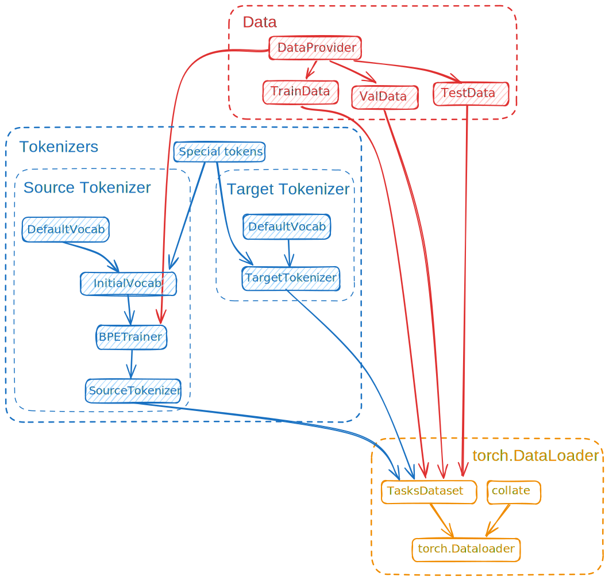

# Planimetrics tasks diagrams generator

#### Available commands are presented in the [Makefile](https://github.com/Dominux/planimetrics_tasks_diagrams_generator/blob/main/Makefile)

## Architecture



### Example output format

```json
[
  {
    "figure": "triangle",
    "name": "ABC"
  },
  {
    "figure": "triangle",
    "name": "A1B1C1"
  },
  {
    "figure": "line",
    "name": "AB",
    "length": "14cm"
  }
]
```
